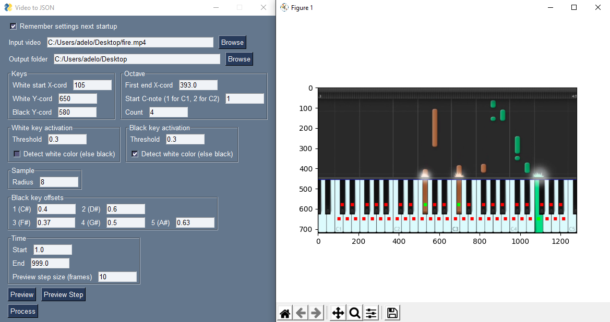
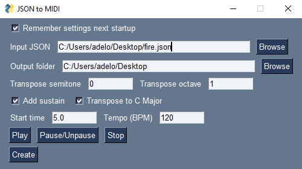

# piano-video-2-midi

Transcribes piano videos (e.g. Synthesia) to MIDI files by pixel variations in image.



Result of video scan is saved in a custom JSON format. A MIDI-file is created by the second "JSON to MIDI"-GUI that allows additional
 customisations. 



## Features

* Detects key presses through color variations in video
* Customisable detection (sensitivity, detect bright/dark color)
* Preview of video sampling
* Preview of MIDI file
* Allows modifying output MIDI, e.g. add sustain, transposing notes, auto transpose to C-major (to make song easier to play)

## Why?

Piano videos are popular on video sites such as Youtube, though often without any provided MIDI-file or piano sheet. 
A MIDI-file is often convenient as it can be played in programs such as [Synthesia](https://www.synthesiagame.com/) or imported into DAWs
 such as  [FL Studio](https://www.image-line.com/).
 
Programs to convert audio to MIDI-files exists, but most are not fully accurate. Transcribing the notes manually from the video is possible but time
  consuming. However, this is in many cases easily done with "piano-video-2-midi".
  
Besides it was fun to make, which should be a reason enough for any software to exist.

## Prerequisites

* Python 3.7 (recommended)

Install dependencies with:

```
pip install PySimpleGUI matplotlib pygame midiutil opencv-python
```


## Instructions

Run `video2json.py` followd by `json2midi.py` found in `src/`-directory.

```bash
python video2json.py
python json2midi.py
```

## Tips

* When previewing a video, hovering over the image will display your mouse's x and y coordinates relative to the image in the lower right
 corner. This helps you input the correct x,y values for the GUI.  
 
* A video file can be downloaded of Youtube-like sites in various ways. If you have Firefox one simple way is to install the [Easy Youtube
 Video Downloader Express](https://addons.mozilla.org/en-US/firefox/addon/easy-youtube-video-download/) or [Video DownloadHelper](https://addons.mozilla.org/en-US/firefox/addon/video-downloadhelper/).

## Known problems

* Fast repeated keypresses of same key can in some cases be transcribed as one keypress. This happens if no frame in the video exists where
 the key is released in between key presses. 
 
## Alternatives

Each solution often comes with different benefits and drawbacks. If this program did not solve your problem feel free to check out these
 alternatives:
 
  * Transcribes music to MIDI using a pretrained neural network in your browser using WebGL (not perfect but still quite impressive):
  https://piano-scribe.glitch.me/
 * An alternative video to MIDI transcriber:
 https://github.com/svsdval/video2midi
